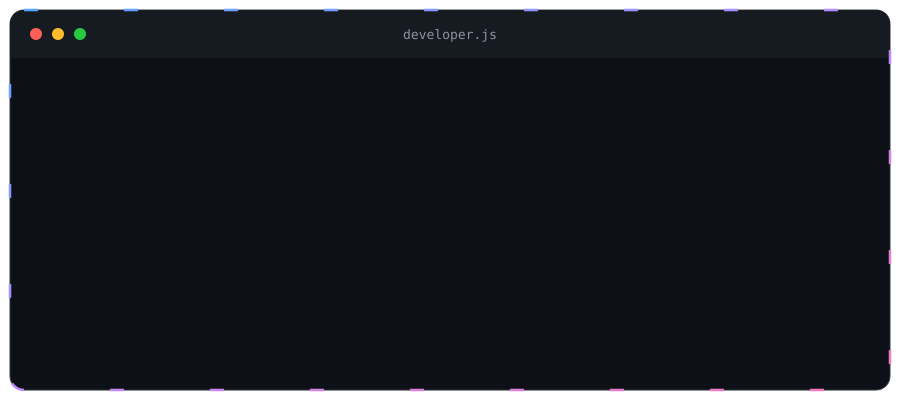
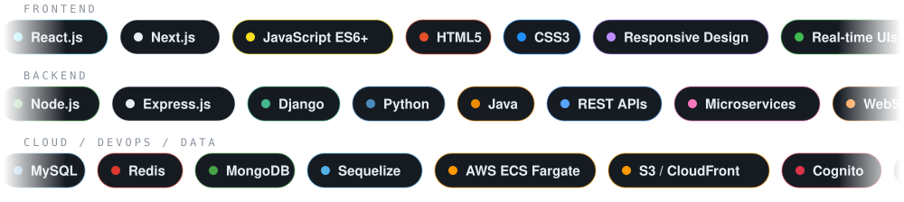
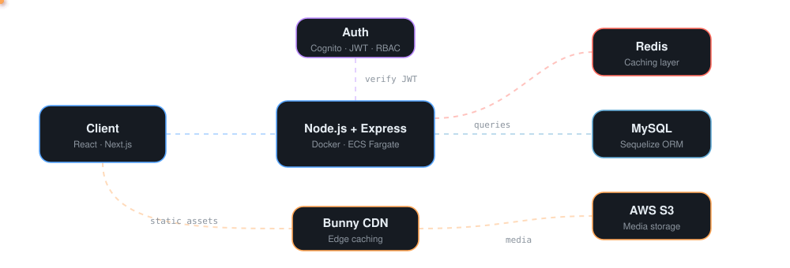

  

  

  
  &nbsp;&nbsp;
  
  &nbsp;&nbsp;
  

 

  

  I build the <b>whole product</b> — fast, secure backend services <i>and</i> responsive, polished interfaces. 
  I enjoy bridging high-performance server logic with clean, dynamic user experiences.

  

 

* 🔭 Building production microservices and multi-tenant SaaS platforms at **Mr Chams Pvt Ltd**
* 🎨 Crafting modern UIs with **React, Next.js, HTML5, CSS3** and **JavaScript (ES6+)**
* ⚙️ Engineering secure REST APIs with **Node.js / Express** and **Django**
* 🚀 Deploying containers to **AWS ECS Fargate** with automated **GitHub Actions CI/CD**
* 🎓 **M.Sc. in Computer Science** with strong fundamentals in data structures and algorithms

 

  

  

 

  

  

 

  

  

 

  

  

 

  

| Project | What I Built | Tech Stack |
| :--- | :--- | :--- |
| **Zaanvar — Consumer Ecosystem** | High-concurrency APIs for pet adoption, e-commerce, vet appointments and grooming for 5,000+ users; Socket.io live chat and tracking; AI moderation with OpenAI and AWS Rekognition (98% accuracy) | Node.js, Express, MySQL, Redis, Socket.io, FCM, Twilio |
| **Zaanvar Vendor — B2B SaaS & POS** | Multi-tenant portal for 200+ clinics, shops and grooming centers: inventory, billing, wallets, ledgers, subscriptions and analytics | Node.js, Sequelize, MySQL, React |
| **Zaanvar Support — Admin & Ops** | Back-office tools for 150+ distributors and support reps; ticket automation cut resolution time by 30% | Node.js, Express, MySQL |
| **Yuva — Payments & Orders** | Payment gateway integration with webhook checksum verification, reducing transaction discrepancies by 25% | Python, Django, MySQL |
| **E-Digital Class Work** | Role-based learning portal for 500+ students; automated reporting cut manual effort by 40% | PHP, MySQL, JavaScript |

 

  

  Open to interesting problems, great teams and ambitious products.

  
  &nbsp;&nbsp;
  
  &nbsp;&nbsp;
  

  

